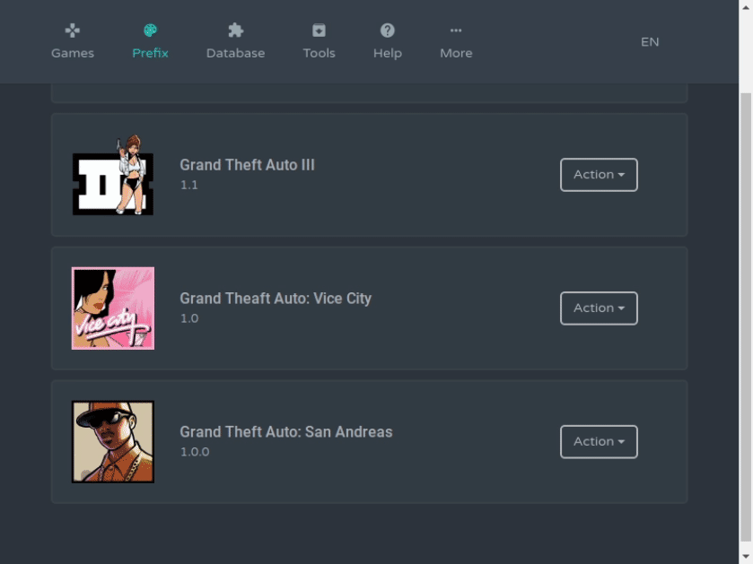

## Wine Launcher
Wine Launcher is a Wine-based container for running Windows applications. 

# Steam Deck Support!

> Review  
  


> Gamepads  



[Video instruction](https://www.youtube.com/watch?v=GRlebaAVWn8)  


```diff
- !!!Warning!!!
! Wine Launcher is not a PREFIX MANAGER like PoL and Lutris!
! Don't try to install all your games into it!
+ Use a separate Wine Launcher for each game.
```

## Philosophy and features of the project:
- Portable assembly.  
- Easy Wine update and prefix re-creation without losing game progress.   
- System isolation, no files are written to the main system.  
- Compressing games into squashfs images.  
- Integration with `Proton`, `VKD3D Proton`, `DXVK`, `MangoHud`, `vkBasalt`, `Media Foundation`, `Gamemode`, 
`AMD FidelityFX Super Resolution`, `ESYNC`, `FSYNC` others.
- Gamepads. Integration with gamepads for games that do not support gamepads. Support for multiple layouts by `next_mapping` key.  
- Diagnostics. Checking the system for correct settings and required libraries installed.  
- Patch system. Auto commit the changes in the prefix and the registry.  


## Installation

1. Download the current [start](https://github.com/hitman249/wine-launcher/releases/latest/download/start) (x86_64 only) file from the [releases](https://github.com/hitman249/wine-launcher/releases) page.
2. Create an empty directory anywhere and move the file there.
3. Make the file executable and run
   ```bash
   chmod +x ./start && ./start
   ```
4. Wait for initialization.
5. Close the launcher and move the `start` file to the `bin` folder that appears.
6. Done.

### Quick command:  
```shell script
mkdir WL; cd "$_"; curl -L https://github.com/hitman249/wine-launcher/releases/latest/download/start --output start; chmod +x ./start; ./start
```

> In one Wine Launcher, it is recommended to install only one game. 
Then it will be more convenient for you to compress it to save
> places in the section `Tools > Packaging`

<details>
<summary><b>How to install the game?</b></summary>
<br>

1. Before installing the game, you need to create a new patch.
2. Give the patch a meaningful name as this word will be called the folder in which the patch is stored.
3. After installing the game, do not forget to save the patch. This will come in handy for you to upgrade **Wine** in the future to recreate the prefix.
4. If you need to install something else, repeat steps 1-3.

> The game must **be sure** installed in the `C:\Games` folder! If another folder is required, it must be reassigned to
> prefix settings, and then recreate it.

<br>
</details>


## Debugging

1. You can run application in the debug mode
    > In this mode the dev tools will be available

   ```bash
   env debug=1 ./start
   ``` 

2. Building the project

   ```bash 
   sudo apt-get install libxtst-dev libpng++-dev
   sudo npm install -g node-gyp
   npm i && cd ./src && npm i && cd ../
   npm run electron-rebuild
   npm run build
   ```  
   > When build finishes, `dist` directory will have executable file `start`

3. Building the project in Docker (required docker-compose)
   ```bash
   ./build.sh
   ```

5. Development

   > Step 1. Launch Vue

   ```bash
   npm run serve
   ```  

   > Step 2. Run application in debug mode

   ```bash
   env debug=1 ./start
   ```

   > Step 3. In the opened dev tools bar, go to

   ```js
   app.href('http://localhost:8080')
   ```
