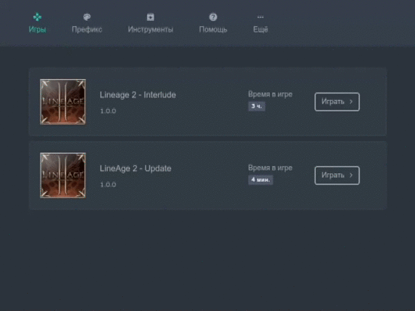
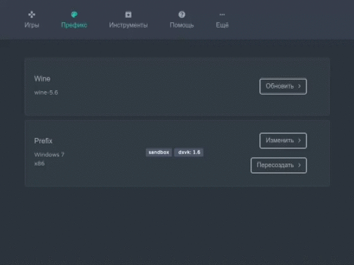
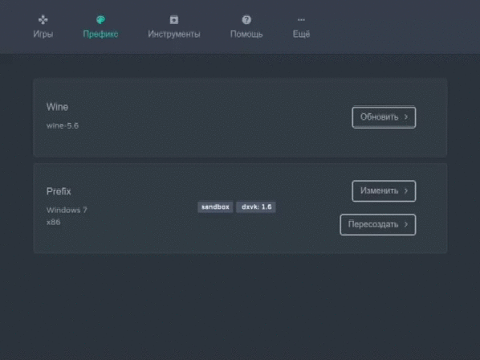
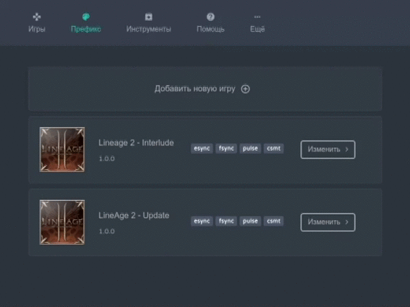
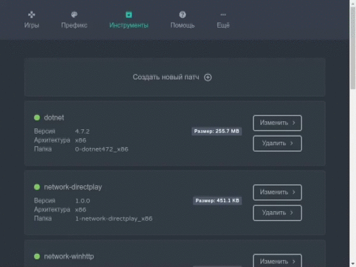
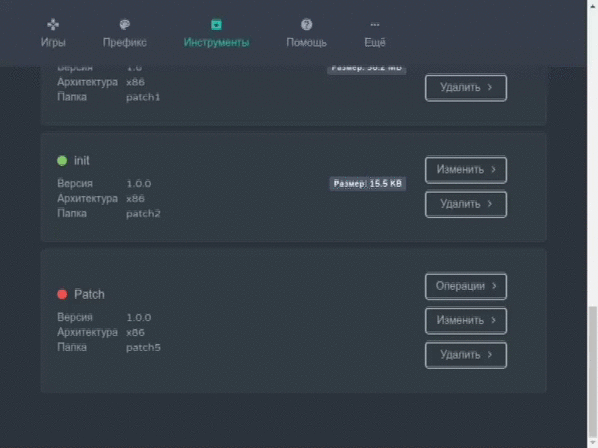

## Что это за проект?

**Wine Launcher** - Инструмент для портирования Windows приложений.  

##### Возможности:

- Отдельный **Wine\Prefix**
- Сжатие **Wine\Data** в **squash** образы для экономия места
- Обновление **Wine**
- Интеграция с **DXVK**, **MangoHud**, **VkBasalt**
- Поддержка нескольких приложений в одном порте
- Генерация патчей
- Диагностика

## Как сделать порт?

Принцип создания порта представляет собой создание слоёв - патчей.  
Любое действие должно быть проведено через систему патчей, будь то установка кодеков, настроек или игры.  
По завершении действия программа сгенерирует патч из **Prefix**-а откуда автоматически выдернет все внесённые изменения.  
Это позволяет отделять каждую программу друг от друга, а также отвязаться от **Prefix**-а, а значит и версии **Wine**.

#### Игры

Реализован простой запуск игр, но расширенный дополнительными возможностями, такими как расширенное логирование и
отображение счетчика FPS.

#### Обновление Wine

Удобный GUI для обновления Wine включает 3 репозитория

#### Настройка Prefix

  * В настройках prefix-а присутствует автоматическая установка DXVK, MangoHud, VkBasalt.  
  * Восстановление разрешения активного монитора после выхода из игры.  

#### Настройки игр

  * Все игры должны устанавливаться в папку по умолчанию, которая задана в настройках prefix-а по умолчанию `Games`.  
  * В самих играх можно задать оформление из **иконки** и **фона**.
  * В настройках игр путь указывается относительно папки `Games`. Будьте внимательны!
    Пример, если путь до исполняемого файла - `C:/Games/The super game/bin/game.exe`, то в настройку игры нужно писать
      - В поле **Путь до папки**: `The super game/bin`
      - В поле **Имя файла**: `game.exe`

#### Патчи

  * Всё что находится в **prefix**-е, оформляется в виде **патчей**.
  * Если вы используете сторонние патчи, то чтобы их применить необходимо пересоздать **prefix**.
  * Другими словами **prefix** не долгоживущая структура, пересоздавать его нужно при каждом изменении версии **wine** 
    или для накатывания сторонних патчей.

#### Создание нового патча

При создании патча вам доступны следующие возможности:  
Перед началом обязательно прочтите **Настройки игр**  ^

  * Установка приложения(игры)
  * Установка приложения(игры) из образа диска
  * Регистрация `dll`, `ocx` библиотек
  * **Winetricks**, доступен из коробки
  * Wine Config
  * Wine File Manager
  * Wine Regedit

