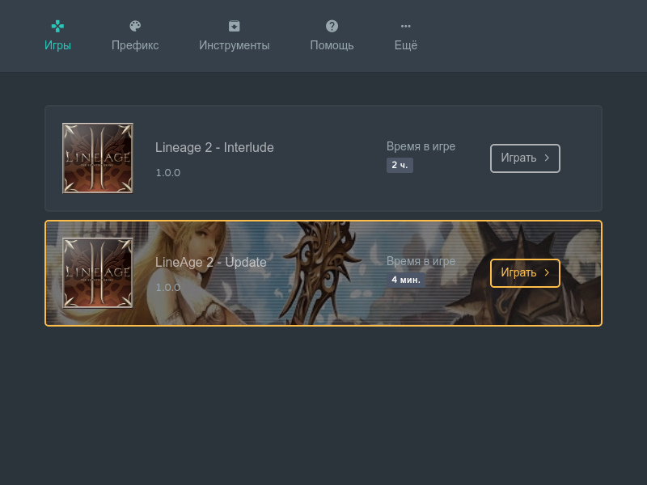

## Что это за проект?

**Wine Launcher** - приложение на Electron для портирования Windows приложений.  

##### Возможности:

- Отдельный **Wine\Prefix**
- Сжатие **Wine\Prefix** в **squash** образы для экономия места
- Обновление **Wine**
- Интеграция с **DXVK**, **MangoHud**, **VkBasalt**
- Поддержка нескольких приложений в одном порте
- Генерация патчей
- Диагностика

## Как сделать порт?

Принцип создания порта представляет из себя создание слоёв - патчей.  
Любое действие должно быть проведено через систему патчей, будь то установка кодеков, настроек или игры.  
По завершении действия программа сгенерирует патч из **Prefix**-а откуда автоматически выдернет все внесённые изменения.  
Это позволяет отделять каждую программу друг от друга, а также отвязаться от **Prefix**-а, а значит и версии **Wine**.

